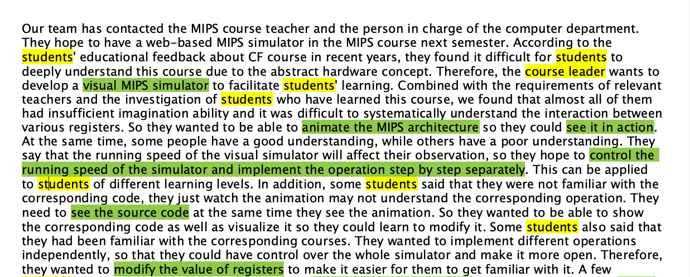
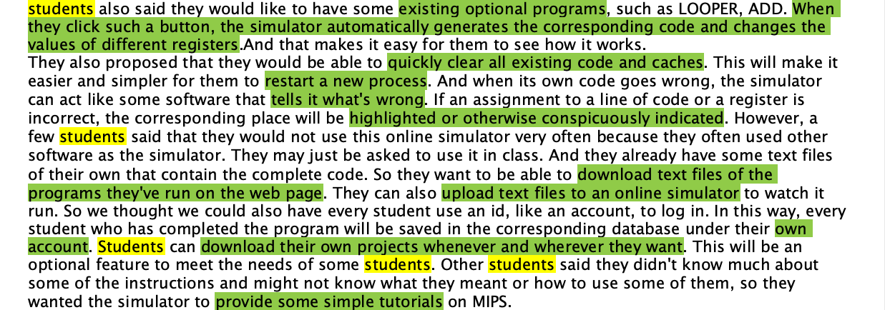
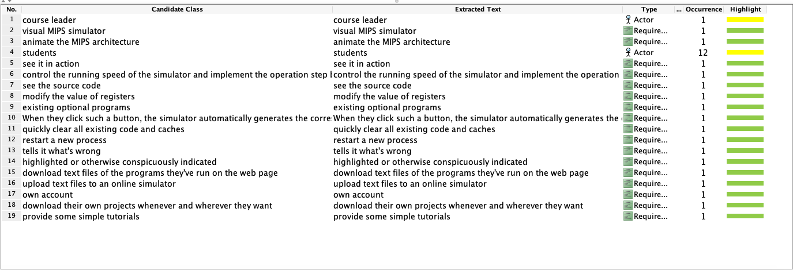

Our team has contacted the MIPS course teacher and the person in charge of the computer department. They hope to have a web-based MIPS simulator in the MIPS course next semester. According to the students' educational feedback about CF course in recent years, they found it difficult for students to deeply understand this course due to the abstract hardware concept. Therefore, the course leader wants to develop a visual MIPS simulator to facilitate students' learning. Combined with the requirements of relevant teachers and the investigation of students who have learned this course, we found that almost all of them had insufficient imagination ability and it was difficult to systematically understand the interaction between various registers. So they wanted to be able to animate the MIPS architecture so they could see it in action. At the same time, some people have a good understanding, while others have a poor understanding. They say that the running speed of the visual simulator will affect their observation, so they hope to control the running speed of the simulator and implement the operation step by step separately. This can be applied to students of different learning levels. In addition, some students said that they were not familiar with the corresponding code, they just watch the animation may not understand the corresponding operation. They need to see the source code at the same time they see the animation. So they wanted to be able to show the corresponding code as well as visualize it so they could learn to modify it. Some students also said that they had been familiar with the corresponding courses. They wanted to implement different operations independently, so that they could have control over the whole simulator and make it more open. Therefore, they wanted to modify the value of registers to make it easier for them to get familiar with it. A few students also said they would like to have some existing optional programs, such as LOOPER, ADD. When they click such a button, the simulator automatically generates the corresponding code and changes the values of different registers. And that makes it easy for them to see how it works. 

They also proposed that they would be able to quickly clear all existing code and caches. This will make it easier and simpler for them to restart a new process. And when its own code goes wrong, the simulator can act like some software that tells it what's wrong. If an assignment to a line of code or a register is incorrect, the corresponding place will be highlighted or otherwise conspicuously indicated. However, a few students said that they would not use this online simulator very often because they often used other software as the simulator. They may just be asked to use it in class. And they already have some text files of their own that contain the complete code. So they want to be able to download text files of the programs they've run on the web page. They can also upload text files to an online simulator to watch it run. So we thought we could also have every student use an id, like an account, to log in. In this way, every student who has completed the program will be saved in the corresponding database under their own account. Students can download their own projects whenever and wherever they want. This will be an optional feature to meet the needs of some students. Other students said they didn't know much about some of the instructions and might not know what they meant or how to use some of them, so they wanted the simulator to provide some simple tutorials on MIPS.

